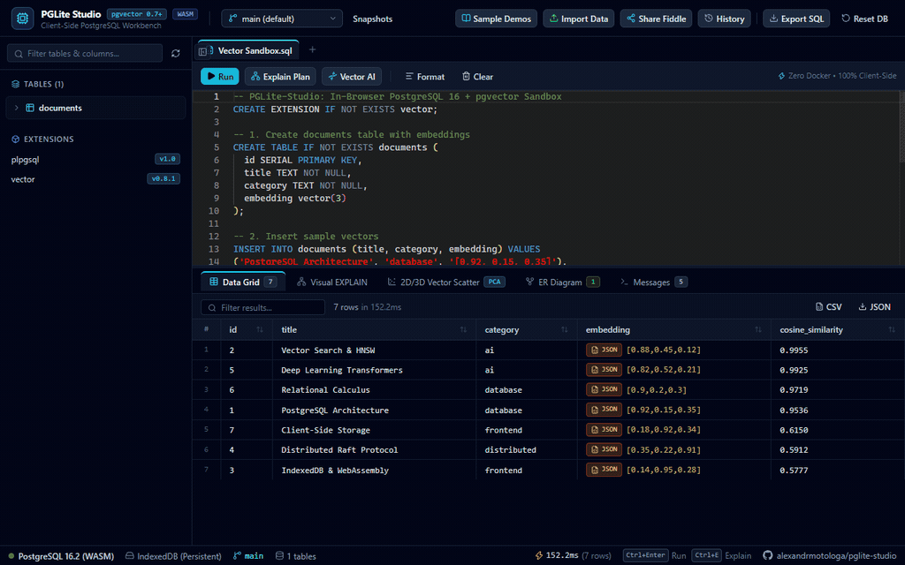
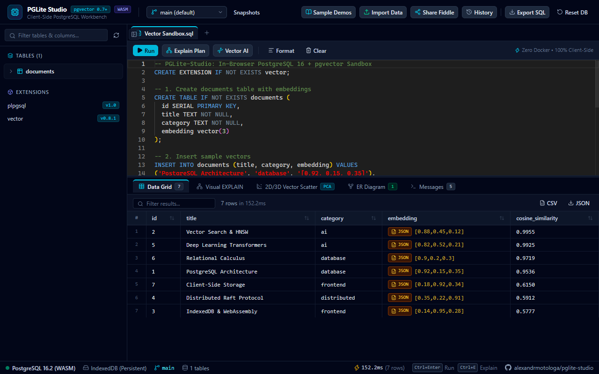
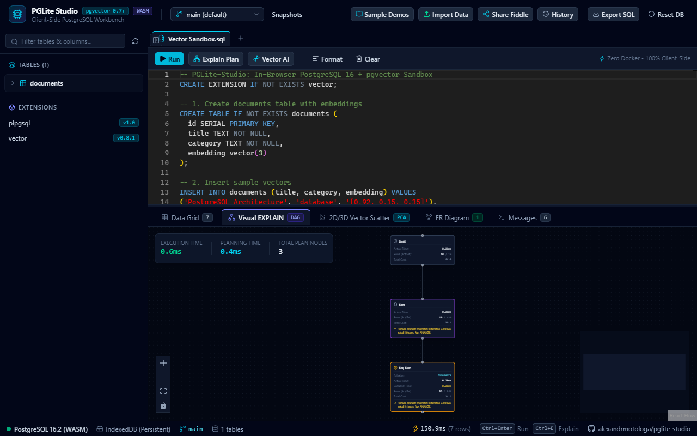
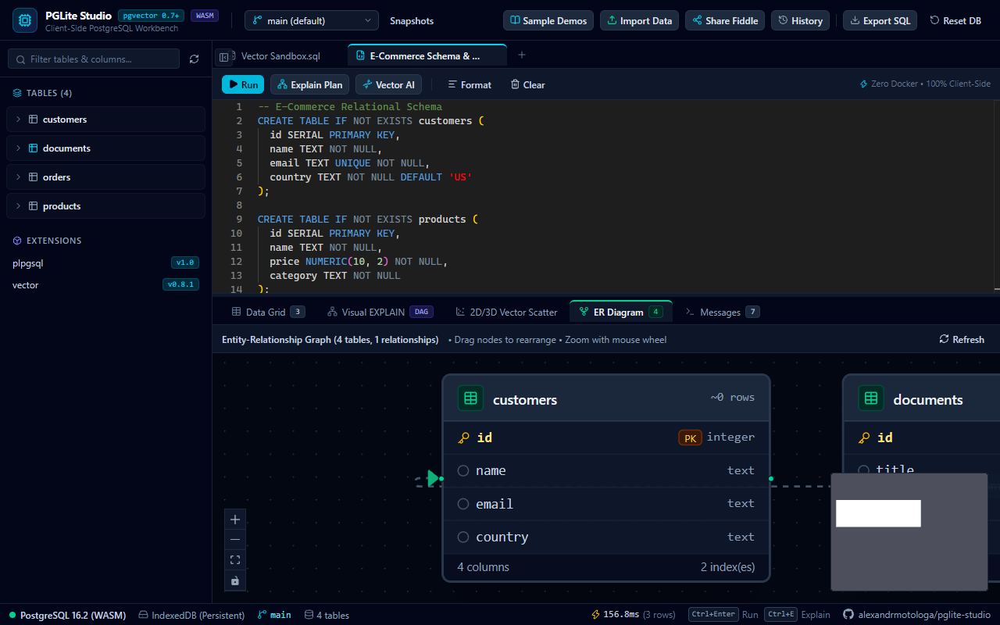
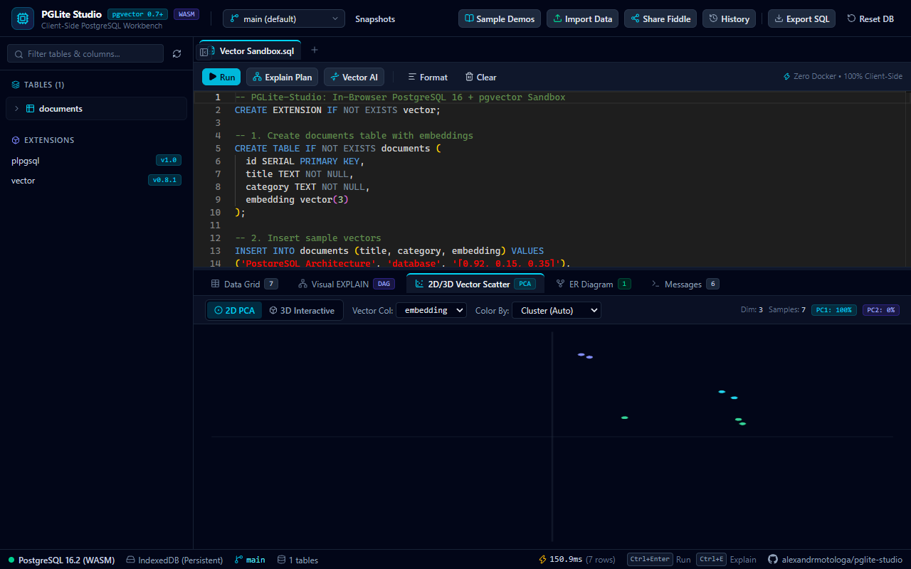
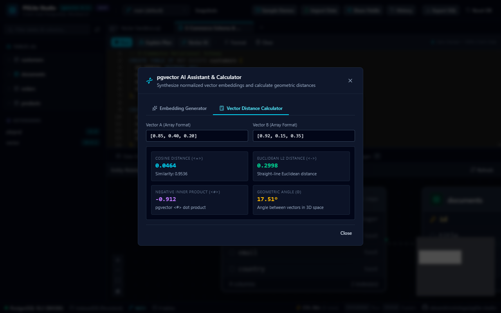
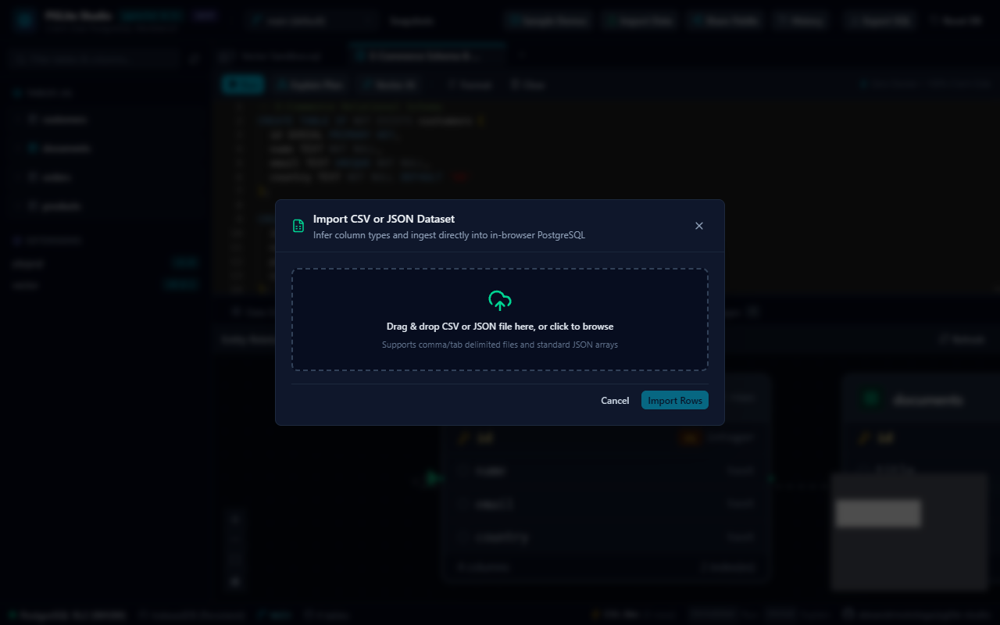
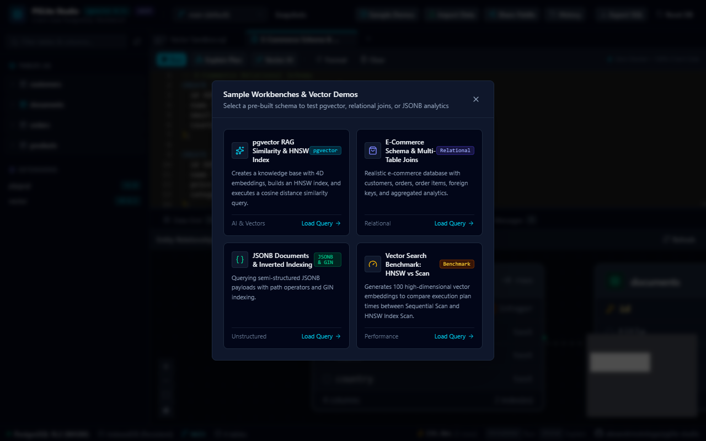

<p align="center">
  
</p>

<h1 align="center">PGLite Studio</h1>

<p align="center">
  
  
  
  
  
  
</p>

<p align="center">
  Client-side PostgreSQL 16 and pgvector workbench running entirely in browser WebAssembly via ElectricSQL's PGlite.
</p>

<p align="center">
  
</p>

PGLite-Studio lets developers prototype schemas, test vector similarity queries, analyze execution plans, and test database migrations without starting local Docker containers or sending data to remote database instances.

## Screenshots

| Interactive Data Grid | Visual EXPLAIN Plan DAG |
| :---: | :---: |
|  |  |

| Interactive ER Diagram | 2D/3D PCA Vector Scatter |
| :---: | :---: |
|  |  |

| pgvector Geometric Calculator | Drag & Drop Dataset Ingestion |
| :---: | :---: |
|  |  |

| Sample Workbenches & Presets |
| :---: |
|  |

## Highlights

* **PostgreSQL 16 in WebAssembly:** Runs an official build of PostgreSQL 16 inside a dedicated browser WebWorker. Queries execute with sub-millisecond latency. Zero data leaves your browser.
* **Native pgvector Extension:** Full support for `vector(N)` columns, cosine distance (`<=>`), L2 distance (`<->`), inner product (`<#>`), and HNSW or IVFFlat indexes.
* **Interactive Entity-Relationship (ER) Diagram:** Visualizes database schemas, table structures, column data types, primary keys, and foreign key edges directly with React Flow.
* **Visual EXPLAIN Plan DAG:** Converts `EXPLAIN (ANALYZE, COSTS, VERBOSE, BUFFERS, FORMAT JSON)` into an interactive execution graph using React Flow. Highlights execution bottlenecks, cost distributions, and sequential scans.
* **2D and 3D PCA Vector Scatter Plot:** Projects multi-dimensional embeddings down to 2D or 3D coordinate space using client-side Principal Component Analysis. Includes an interactive cosine similarity inspector and cluster coloring.
* **pgvector AI Assistant & Distance Calculator:** Synthesizes normalized vector embeddings at arbitrary dimensions (3, 8, 384, 768, 1536) and computes live Cosine, Euclidean L2, Inner Product, and angular geometric metrics between vector pairs.
* **Monaco SQL Editor with Schema-Aware IntelliSense:** Autocompletion for tables, columns, primary keys, and pgvector operators dynamically connected to live schema catalogs. Includes `Run Selection`, tab persistence, inline renaming, and SQL formatting (`Ctrl+Shift+F`).
* **Drag-and-Drop CSV & JSON Ingestion:** Ingest raw files with automatic column type inference (`INTEGER`, `DOUBLE PRECISION`, `BOOLEAN`, `TIMESTAMP`, `vector`, `TEXT`), schema generation, and batched inserts.
* **Inline Data Editing & JSONB Inspector:** Double-click cells in the Data Grid to edit values with staged change reviews, plus a dedicated JSON tree inspector with live search and path copying.
* **Shareable Fiddle Links:** Compresses queries and titles into URL hash parameters via LZ-String for frictionless collaboration.
* **IndexedDB Database Branching:** Stores databases in browser IndexedDB. Users can create isolated database branches to test destructive migrations without modifying the baseline database.

## Architecture

PGLite-Studio runs the PostgreSQL engine off the main browser thread to keep the user interface responsive during heavy queries and vector computations:

```
[ Monaco SQL Editor ] ──> [ PGLiteClient ] ──> [ Web Worker (pglite.worker.ts) ]
                                                        │
                                   ┌────────────────────┴────────────────────┐
                                   ▼                                         ▼
                        [ PostgreSQL 16 WASM ]                    [ IndexedDB Storage ]
                        - pgvector Extension                      - idb://pglite-studio-main
                        - Query Planner & Executor                - Isolated Branches
                                   │
                                   ▼
               [ Results: DataGrid, EXPLAIN DAG, PCA Scatter ]
```

## Quick Start

### Prerequisites

* Node.js 18+ (tested on Node 20 and 24)
* npm 9+

### Installation

```bash
# Clone the repository
git clone https://github.com/alexandrmotologa/pglite-studio.git
cd pglite-studio

# Install dependencies
npm install

# Start development server
npm run dev
```

Open `http://localhost:5173` in your browser.

### Building for Production

```bash
npm run build
npm run preview
```

## Built-In Sample Workbenches

PGLite-Studio includes four pre-configured SQL schemas:

1. **RAG Vector Search:** Creates a document table with 4D embeddings, builds an HNSW index, and evaluates nearest-neighbor similarity using cosine distance.
2. **E-Commerce Relational Model:** Demonstrates multi-table joins, foreign keys, cascade deletes, and aggregated financial metrics.
3. **JSONB Analytics and Inverted Indexing:** Queries nested document payloads and creates GIN inverted indexes for path lookups.
4. **HNSW Vector Benchmark:** Populates 100 high-dimensional vectors and compares execution plans between sequential scans and indexed searches.

## Keyboard Shortcuts

* `Ctrl + Enter` (or `Cmd + Enter`): Execute SQL query
* `Ctrl + E` (or `Cmd + E`): Run EXPLAIN ANALYZE execution plan
* `Escape`: Close open modal dialogs

## Tech Stack

* **Engine:** `@electric-sql/pglite`, `@electric-sql/pglite-pgvector`
* **Frontend Framework:** React 19, TypeScript 5.6, Vite 8
* **Styling:** Tailwind CSS
* **Code Editor:** `@monaco-editor/react`
* **Graph Visualization:** `@xyflow/react`
* **Data Grid:** `@tanstack/react-table`
* **State Management:** `zustand`
* **Icons:** `lucide-react`

## License

MIT License. See [LICENSE](LICENSE) for details.
